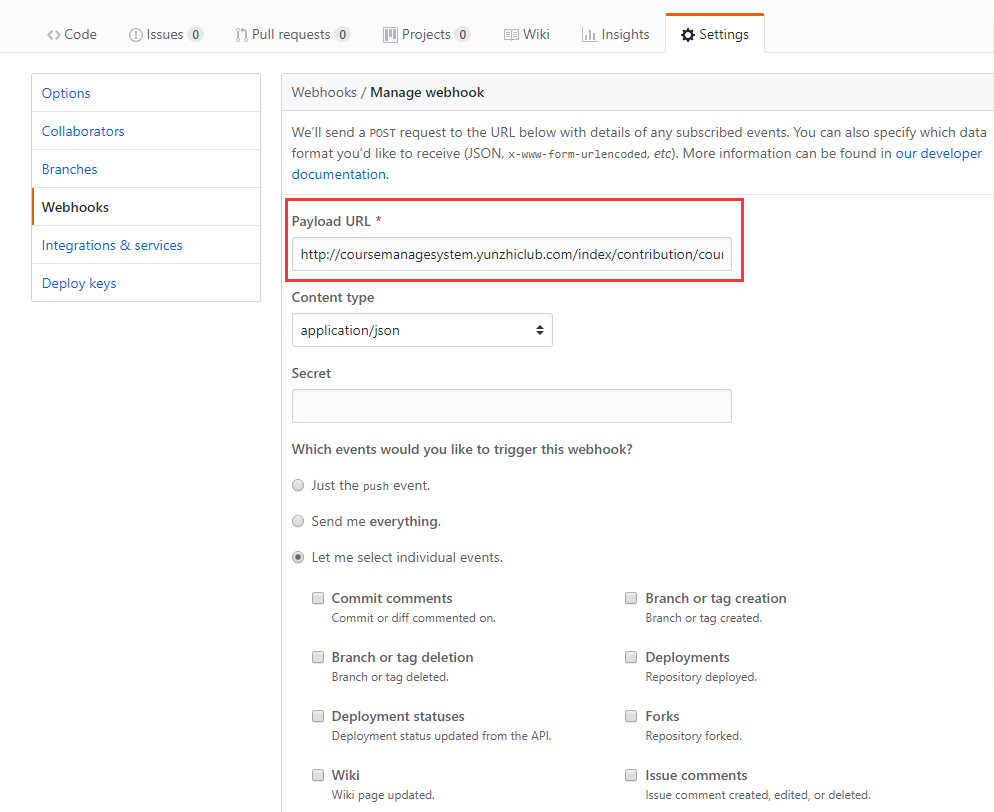
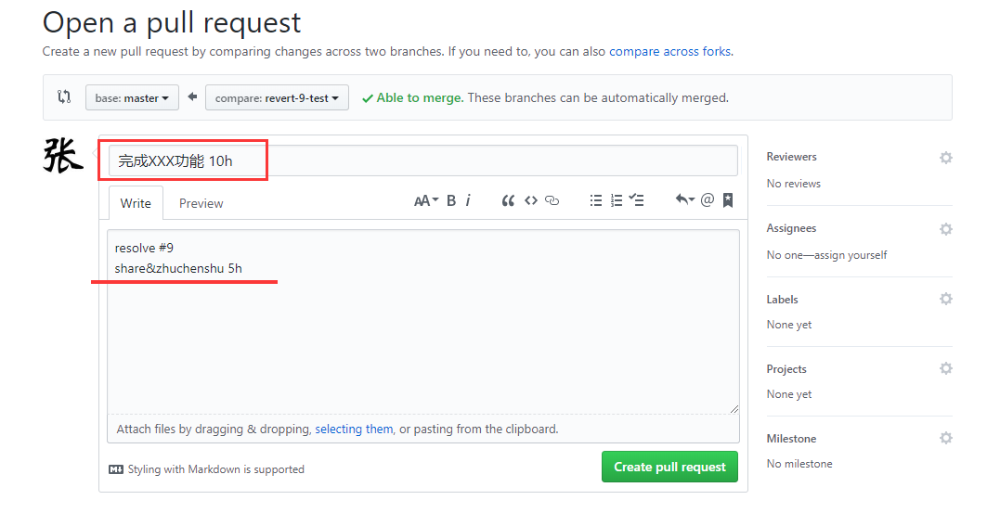

# 梦云智课表管理系统

## 贡献值管理功能

### 数据库配置

在原数据库上略做修改。

`User`表中添加字段`contribution`，数据类型为`float`，默认值为`0`。

`User`表中添加字段`coefficient`，数据类型为`int`，默认值为`1`。

新建数据表`yunzhi_contribution`。

---
| 字段 | 数据类型 | 属性 | 注释 |
| - | :-: | :-: | -: |
| id | int | 主键、非空、自增 | 主键id |
| username | varchar(255) | 非空、外键 | 对应user表中的username |
| state | float | 非空 | 用户贡献值状态 |
| time | int | 非空 | 时间戳 |
| source | varchar(255) | | 来源仓库 |
| remark | varchar(255) | | 备注 |
---

### 如何使用

打开`Github`仓库，依次选择`Settings`->`Webhooks`->`Add webhook`，添加一个`web`钩子。

依次填入我们接收数据的`url`(`C`层中的`interface`方法)，类型选择`application/json`，事件选择`Let me select individual events`。

事件中选择`Pull Request`，点击`Add webhook`添加完成。

使用`Github`提交一个`Pull Request`。

标题中写本次提交的所花费的时间，例： `xxx 几h`。

注意：标题中只允许出现一个空格，即`完成XXX功能 2h`，出现额外空格会出现错误。

如果受人帮助，想给他人分享贡献值，在主体中除了`resolve`某个`issue`之外，还要写上与他人共享，`share&用户名 几h`。

可以直接在贡献值管理模块查看贡献值。

同时查看贡献值的详细信息。

同时也可以对贡献值进行增加或删除，如用贡献值换置设备。

### 注意

**因为本系统与`Github`对接，所以需要确保您在本系统中的用户名与`Github`用户名保持一致才可进行贡献值统计。**
